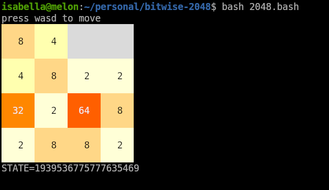

# [The Bitwise Challenge][bitwise-challenge]: 2048

<div align="center">
    <a href="https://github.com/zesterer/the-bitwise-challenge">
        <picture>
            
        </picture>
    </a>
    <div align="center">
        <em>A terminal implementation of the classic 2048 game.</em>
        <br>
        <em>
        Written in Bash, <a href="https://github.com/zesterer/the-bitwise-challenge">with only 64 bits of state</a>.
        </em>
        <br>
        <br>
    </div>
</div>

Copy and paste this command to play:

```bash
bash <(curl -fsSL https://raw.githubusercontent.com/izabera/bitwise-challenge-2048/develop/2048.bash)
```

Or download the script and run it locally:

```bash
# curl -fsSL https://raw.githubusercontent.com/izabera/bitwise-challenge-2048/develop/2048.bash -o 2048.bash
# chmod +x 2048.bash
bash 2048.bash
```

If the `$STATE` environment variable isn't set, the game generates a fresh random seed. Otherwise, the board state and all future spawned cells will be deterministic.

You can share your game state with friends by just sending them a number!

[bitwise-challenge]: https://github.com/zesterer/the-bitwise-challenge